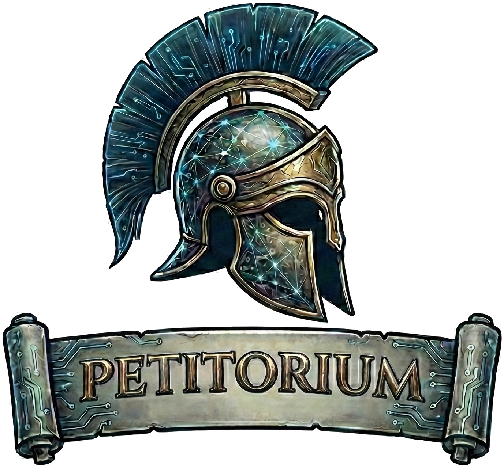

<p align="center">
  
</p>

# Petitorium

A powerful Terminal API Testing Client

## Keybindings

### Global Navigation

- `Tab` - Cycle focus forward through main panels and elements
- `Shift+Tab` - Cycle focus backward
- `Ctrl+w` - Show workspace menu
- `q` / `Q` - Quit application

### Collections Panel

- `j` / `k` - Navigate up/down in tree
- `h` - Collapse collection / Move to parent collection
- `l` - Expand collection / Select request
- `g` / `G` - Go to top / bottom of tree
- `N` - Create new collection
- `n` - Create new request
- `D` (Shift+D) - Duplicate selected request
- `r` - Rename selected item
- `m` - Move selected item
- `d` - Delete selected item

### Request Panel

- `1`, `2`, `3`, `4` - Switch tabs (Body, Auth, Query, Headers)
- `Left` / `Right` Arrow - Previous / Next tab
- `Tab` - Cycle through request elements (Method → URL → Send → Curl → Tab Headers → Tab Content)
- `i` - Enter insert mode (edit body inline) or open external editor (context dependent)
- `F4` - Open body in external editor (or bulk edit headers when in Headers tab)
- `Enter` (on Send button) - Send HTTP request

### Header Editing

- `i` - Enter edit mode for header values
- `Esc` - Exit edit mode and return to view mode

### Body View Panel (Vim-style navigation)

- `h` / `j` / `k` / `l` - Scroll left / down / up / right
- `g` / `G` - Go to top / bottom
- `w` / `b` - Page down / up

### Body Edit Mode (Inline)

- `Esc` - Exit insert mode
- `Ctrl+s` - Save body content
- `Ctrl+h` / `j` / `k` / `l` - Move cursor left / down / up / right

### Response Panel

- `j` / `k` - Scroll down / up
- `g` / `G` - Go to top / bottom
- `d` / `u` - Half-page scroll down / up
- `f` - Open response in `fx` (if installed)
- `1`, `2`, `3`, `4` - Switch tabs (Preview, Headers, Cookies, Timeline)
- `Left` / `RightArrow` - Previous / Next tab

## Features

- **API Request Management**: Organize requests into collections and folders.
- **Multiple HTTP Methods**: Support for GET, POST, PUT, DELETE, PATCH, HEAD, and OPTIONS.
- **Environment Variables**: Use variables in URLs, headers, and bodies with automatic substitution.
- **External Editor Integration**: Edit request bodies and headers in your favorite system editor (e.g., Vim, Nano, VS Code).
- **Body Editing**: Inline body editor with syntax highlighting and variable support.
- **Response Viewing**: Vim-style navigation for viewing response bodies, headers, and cookies.
- **JSON Exploration**: Open JSON responses in `fx` for advanced exploration.
- **Workspace Support**: Manage multiple independent workspaces for different projects.
- **cURL Export**: Quickly export any request as a cURL command.
- **Themes & Styling**: Configurable themes and colors for a personalized TUI experience.
- **Persistence**: Remembers collection expansion states and selected environments.

## Installation

```bash
go install github.com/petitorium/petitorium@latest
```

## Usage

```bash
petitorium
```

### Sending HTTP Requests

1. Select a request from the collections panel
2. Choose HTTP method from dropdown
3. Enter URL in the input field
4. Add headers in the Headers tab
5. Write request body in the Body tab
6. Press `Enter` on the Send button or navigate to it and press `Enter`

### Body Editing Workflow

- Press `i` to open body in external editor for editing (main interface)
- Press `F4` to open body in external editor (main interface or when creating new requests)
- The external editor provides full support for pasting, complex editing, and syntax highlighting

## Themes

Petitorium supports a wide range of syntax highlighting themes, many of which provide "Unified Theming" to style the entire application UI.

### Listing Available Themes

To see all available themes, run:

```bash
petitorium themes
```

**Available Themes:**

- **Unified Themes (★):** monokai, solarized-dark, one-dark, gruvbox, doom-one, tokyonight-night, dracula, nord, vim, catppuccin-mocha, evergarden, rose-pine-moon, github-dark.
- **Popular Choices:** github-dark, dracula, monokai, solarized-dark, nord, one-dark.

### Switching Themes

You can switch the application theme directly from the CLI:

```bash
petitorium themes switch solarized-dark
```

_Note: The new theme will be applied when you restart Petitorium._

## Configuration

Configuration files are stored in `~/.config/petitorium/`:

- `config.yaml` - Application settings and themes
- `collections.yaml` - API collections and requests
- `expansion_state.yaml` - Collection expansion states
